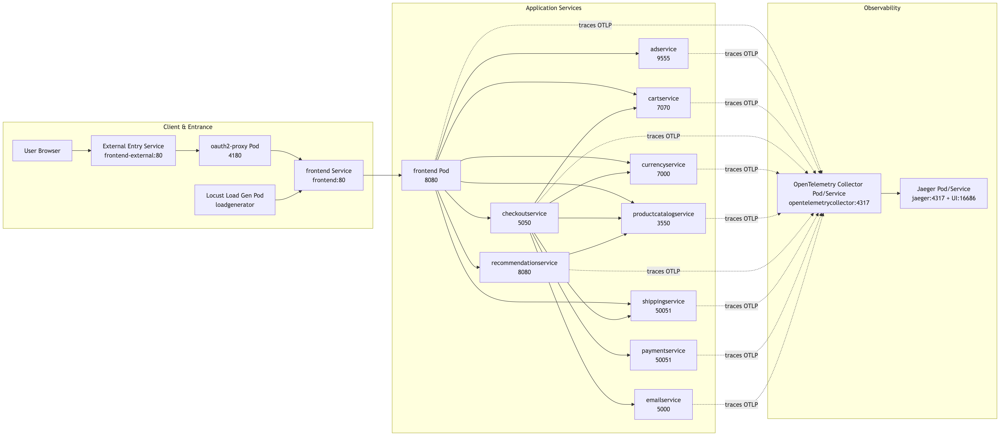

Restructured from Google's [microservices-demo](https://github.com/GoogleCloudPlatform/microservices-demo), this project includes the following key updates:

* **Go Rewrite:** Ported all non-Python backend services to Go.
* **OpenTelemetry Integration:** Integrated full-chain tracing,  services report traces to a central Collector, which exports to **Jaeger**.
* **Observability:** Added Kubernetes configurations for **Jaeger** to enable the tracing Web UI in local deployments.
* **Python Modernization:** Replaced `pip` with `uv` for more efficient Python package management.
* **Network Optimization:** Configured Dockerfiles with local mirror sources to bypass network issues (*pre-pulling* base images recommended).
* **Refactoring & Bug Fixes:** Improved code quality and reliability, including implementing *graceful shutdowns* and standardizing development practices.
* **Identity & Auth:** Integrated [OAuth2 Proxy](https://github.com/oauth2-proxy/oauth2-proxy) with **Google login**, handling authentication, callbacks, session management, and identity header propagation to business contexts.

## Architecture



| Service Name | Language | Description |
| :--- | :--- | :--- |
| **frontend** | Go | Web frontend and BFF (Backend for Frontend) gateway; handles page rendering, routing, session/auth context, and invokes downstream gRPC services. |
| **productcatalogservice** | Go | Product catalog service; provides product listing and item detail queries. |
| **cartservice** | Go | Cart service; manages CRUD operations for shopping carts and maintains user cart states. |
| **checkoutservice** | Go | Checkout orchestration service; aggregates product, shipping, payment, and email services to complete the ordering process. |
| **paymentservice** | Go | Payment service; processes credit card payment requests and returns transaction results. |
| **shippingservice** | Go | Shipping service; provides shipping cost estimation and delivery-related capabilities. |
| **currencyservice** | Go | Currency and exchange rate service; supports multi-currency price calculations. |
| **adservice** | Go | Ad service; provides advertising content for site pages. |
| **recommendationservice** | Python | Recommendation service; returns recommended products based on user context. |
| **emailservice** | Python | Email service; handles order confirmations and other email notifications. |
| **loadgenerator** | Python | Load testing service based on Locust; simulates user traffic for performance and stability validation. |
| **oauth2-proxy** | Go (3rd-party) | Authentication proxy; integrates with Google OAuth2/OIDC, handles login callbacks and session cookies, and injects identity headers for the frontend. |
| **opentelemetrycollector** | Go (3rd-party) | OpenTelemetry Collector; unified receiver for traces from all services, exporting them to observability backends. |
| **jaeger** | Go (3rd-party) | Distributed tracing backend and UI; stores and visualizes distributed call chains. |
| **shoppingassistantservice (Reserved)** | TBD | AI assistant entry point; currently reserved via frontend toggles and routing for future independent service integration. |

## Quickstart(local)

### Prerequisites

This project runs on a Kubernetes cluster on Linux or macOS. While `minikube` and `kind` are both options for local clusters, **`kind`** is recommended.

Ensure you have installed `skaffold`, `kind`, `kubectl`, `docker`, and `docker-buildx` (included in Docker Desktop for macOS). Arch Linux users can quickly install these via `pacman`.

1. Create a cluster:

```bash
kind create cluster --name mydemo
```

2. Configure Skaffold for the local cluster:

```bash
skaffold config set --global local-cluster true
```

3. Set the kubectl context:

```bash
kubectl cluster-info --context kind-mydemo
```

### Deployment

To prevent image piling up in a `kind` cluster (see [Skaffold Cleanup](https://skaffold.dev/docs/cleanup/)), run:

```sh
skaffold dev --no-prune=false --cache-artifacts=false
```

If piling up has already occurred, prune unused images with:

```bash
docker rmi $(docker images --format "{{.Repository}}:{{.Tag}}" | grep -E "service|frontend|loadgenerator|skaffold")
```

<details>
<summary>Deployment for Mainland China Users</summary>

Under the pretext of *unvetted content* mainland China has long utilized the [GFW](https://en.wikipedia.org/wiki/Great_Firewall) to perform indiscriminate blocking of overseas websites, with Docker's official registries also caught in the crossfire. Consequently, the Chinese internet has seen a surge of low-quality "Docker Mirror" sites—such as the xuanyuan mirror, which treat image hosting as a primary profit-making scheme. However, for individual users, Docker Hub should not, and must not, ever become a paid service. I strongly advise against using such paywalled mirrors; to do so is to feed a *predatory* system. Furthermore, the image lists provided by services like xuanyuan are severely incomplete—for instance, the Alpine-based images used in this project cannot be pulled from them, making them unworthy of a single cent of your investment.

Within the project's Dockerfiles, except for the base images which may require manual pulling, all dependency sources have been pre-configured with mainland China mirror sites, ensuring that dependency retrieval proceeds without issue.

If you encounter pull errors such as
`Error: container redis is waiting to start: redis:alpine can't be pulled.` you can leverage `kind`'s integration with the local Docker daemon. Simply pull the image locally, re-tag it, and import it into the cluster.

E.g. Import `golang:1.26.1-alpine` into the cluster:

1.  Pull the image locally using a free mirror:
    ```sh
    docker pull m.daocloud.io/docker.io/library/golang:1.26.1-alpine
    ```

2.  Re-tag it to match the Dockerfile:
    ```sh
    docker tag m.daocloud.io/docker.io/library/golang:1.26.1-alpine golang:1.26.1-alpine
    ```

3.  Load the image into your cluster (e.g., `mydemo`):
    ```sh
    docker save golang:1.26.1-alpine | docker exec -i mydemo-control-plane ctr -n k8s.io images import -
    ```

The cluster will now use the locally cached image for future deployments.

</details>
