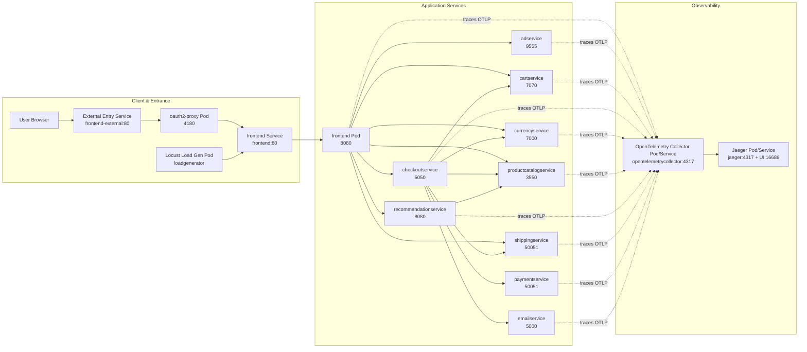
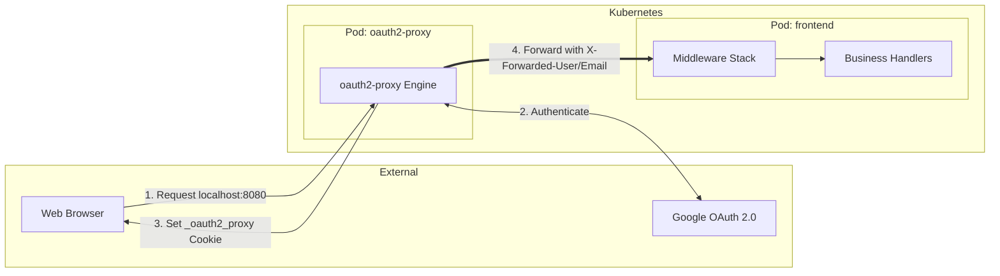
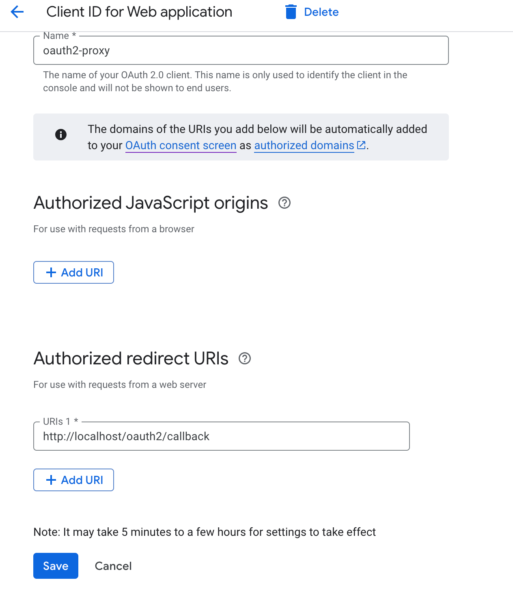

**Curated Store** is restructured from Google's [microservices-demo](https://github.com/GoogleCloudPlatform/microservices-demo), including the following key updates:

* **Authentication:** Add a login button on the homepage header and integrated [OAuth2 Proxy](https://github.com/oauth2-proxy/oauth2-proxy) with **Google login**, handling authentication, callbacks, session management, and identity header propagation to business contexts.
* **Go Rewrite:** Ported all non-Python backend services to Go.
* **OpenTelemetry Integration:** Integrated **full-chain tracing**, services report traces to a central Collector, which exports to **Jaeger**.
* **Observability:** Added Kubernetes configurations for Jaeger to enable the tracing **Web UI** in local deployments.
* **Python Modernization:** Replaced `pip` with `uv` for more efficient Python package management.
* **Network Optimization:** Configured Dockerfiles with local mirror sources to bypass network issues (*pre-pulling* base images recommended).
* **Refactoring & Bug Fixes:** Improved code quality and reliability, including implementing *graceful shutdowns* and standardizing development practices.

## Architecture



OAuth2 proxy (See [here](./docs/login.md) for more details):



| Service Name | Language | Description |
| :--- | :--- | :--- |
| **frontend** | Go | Web frontend and BFF (Backend for Frontend) gateway; handles page rendering, routing, session/auth context, and invokes downstream gRPC services. |
| **productcatalogservice** | Go | Product catalog service; provides product listing and item detail queries. |
| **cartservice** | Go | Cart service; manages CRUD operations for shopping carts and maintains user cart states. |
| **checkoutservice** | Go | Checkout orchestration service; aggregates product, shipping, payment, and email services to complete the ordering process. |
| **paymentservice** | Go | Payment service; processes credit card payment requests and returns transaction results. |
| **shippingservice** | Go | Shipping service; provides shipping cost estimation and delivery-related capabilities. |
| **currencyservice** | Go | Currency and exchange rate service; supports multi-currency price calculations. |
| **adservice** | Go | Ad service; provides advertising content for site pages. |
| **recommendationservice** | Python | Recommendation service; returns recommended products based on user context. |
| **emailservice** | Python | Email service; handles order confirmations and other email notifications. |
| **loadgenerator** | Python | Load testing service based on Locust; simulates user traffic for performance and stability validation. |
| **oauth2-proxy** | Go (3rd-party) | Authentication proxy; integrates with Google OAuth2/OIDC, handles login callbacks and session cookies, and injects identity headers for the frontend. |
| **opentelemetrycollector** | Go (3rd-party) | OpenTelemetry Collector; unified receiver for traces from all services, exporting them to observability backends. |
| **jaeger** | Go (3rd-party) | Distributed tracing backend and UI; stores and visualizes distributed call chains. |
| **shoppingassistantservice (Reserved)** | TBD | AI assistant entry point; currently reserved via frontend toggles and routing for future independent service integration. |

## Quickstart

### Prerequisites

Curated Store runs on a local Kubernetes cluster on **Linux** or **macOS**. While `minikube` and `kind` are both options for local clusters, **`kind`** is recommended.

Ensure you have installed `skaffold`, `kind`, `kubectl`, `docker`, and `docker-buildx` (included in Docker Desktop for macOS). 

1. Create a cluster:
   ```bash
   kind create cluster --name mydemo
   ```

2. Configure Skaffold for the local cluster:
   ```bash
   skaffold config set --global local-cluster true
   ```

3. Set the kubectl context:
   ```bash
   kubectl cluster-info --context kind-mydemo
   ```

4. Create a client on [Google Auth Platform](https://console.cloud.google.com/auth/) and set the redirect URI to `http://localhost/oauth2/callback`, then save your **Client ID** and **Client secrets**

   

1. `oauth2-proxy` will retrieve `Client ID`, `Client secrets` and `Cookie Secret` from a [Kubernetes Secret](https://kubernetes.io/docs/concepts/configuration/secret/) named `oauth2-proxy-credentials`, so create a `.env.secret` file under `kubernetes-manifests/` with the following content(See [here](https://oauth2-proxy.github.io/oauth2-proxy/configuration/overview?_highlight=cookie#generating-a-cookie-secret) for instructions on generating a cookie secret):
   ```
   OAUTH2_PROXY_CLIENT_ID=Your_Client_ID
   OAUTH2_PROXY_CLIENT_SECRET=Your_Client_Secret
   OAUTH2_PROXY_COOKIE_SECRET=Your_Cookie_Secret
   ```
   These variables are used by the `secretGenerator` in `kustomization.yaml` so secrets will be automatically mounted upon cluster startup.

### Deployment

Deploy Curated Store to the cluster. To prevent image piling up in a `kind` cluster (see [Skaffold Cleanup](https://skaffold.dev/docs/cleanup/)), run:

```sh
skaffold dev --no-prune=false --cache-artifacts=false
```

> If image piling up has already occurred, you can prune unused images with
> 
> ```bash
> docker rmi $(docker images --format "{{.Repository}}:{{.Tag}}" | grep -E "service|frontend|loadgenerator|skaffold")
> ```

<details>
<summary>Deployment for Mainland China Users</summary>

Within the project's Dockerfiles, except for the base images(e.g. `golang:1.26.1-alpine`) which may require manual pulling, all dependency sources have been pre-configured with China mirror sites, ensuring that dependency retrieval proceeds without issue.

If you encounter pull errors such as
`Error: container redis is waiting to start: redis:alpine can't be pulled.` you can leverage `kind` integration with the local Docker daemon. Simply pull the image locally, re-tag it, and import it into the cluster.

E.g. Import `golang:1.26.1-alpine` into the cluster:

1.  Pull the image locally using a free mirror:
    ```sh
    docker pull m.daocloud.io/docker.io/library/golang:1.26.1-alpine
    ```

2.  Re-tag it to match the Dockerfile:
    ```sh
    docker tag m.daocloud.io/docker.io/library/golang:1.26.1-alpine golang:1.26.1-alpine
    ```

3.  Load the image into your cluster (e.g. `mydemo`):
    ```sh
    docker save golang:1.26.1-alpine | docker exec -i mydemo-control-plane ctr -n k8s.io images import -
    ```

The cluster will now use the locally cached image for future deployments.

</details>

Wait for the pods to be ready.

```sh
kubectl get pods
```

After a few minutes, you should see the Pods in a `Running` state:

```
NAME                                      READY   STATUS    RESTARTS   AGE
adservice-6fcc69c799-zlg4k                1/1     Running   0          57s
cartservice-5f8c8f68c8-njf4v              1/1     Running   0          57s
checkoutservice-85f7b5bd8f-8rwzv          1/1     Running   0          57s
currencyservice-8c4c8bfbf-pqzff           1/1     Running   0          57s
emailservice-6ff8c9bf5b-rfzb5             1/1     Running   0          57s
frontend-776c7d4dfd-sgfjs                 1/1     Running   0          57s
jaeger-5fb8ff4975-vn7z6                   1/1     Running   0          57s
oauth2-proxy-69678746d-tpvcr              1/1     Running   0          57s
opentelemetrycollector-7dc65db447-9m24l   1/1     Running   0          57s
paymentservice-584f5888dc-v9bvt           1/1     Running   0          57s
productcatalogservice-f6ddf64ff-qg7rw     1/1     Running   0          56s
recommendationservice-d485dc5c4-gtm24     1/1     Running   0          56s
redis-cart-94dff57f9-2tnqr                1/1     Running   0          56s
shippingservice-559d8bd99c-bnrxv          1/1     Running   0          56s
```

Access the web in a browser:

- frontend: http://localhost:8080
- Jaeger: http://localhost:16686

## Documentation

- [Middleware Chain](./docs/middleware.md)
- [Authentication and Login](./docs/login.md)
- [Opentelemetry Integration](./kubernetes-manifests/components/opentelemetry/README.md)
