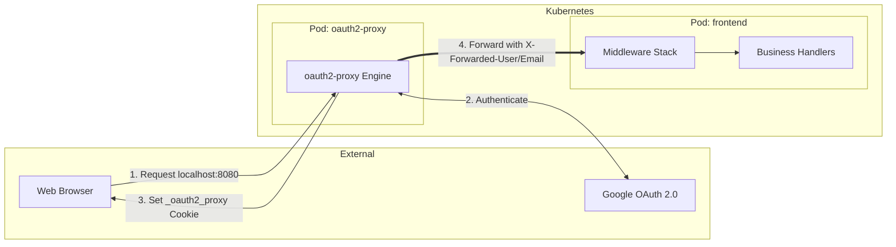
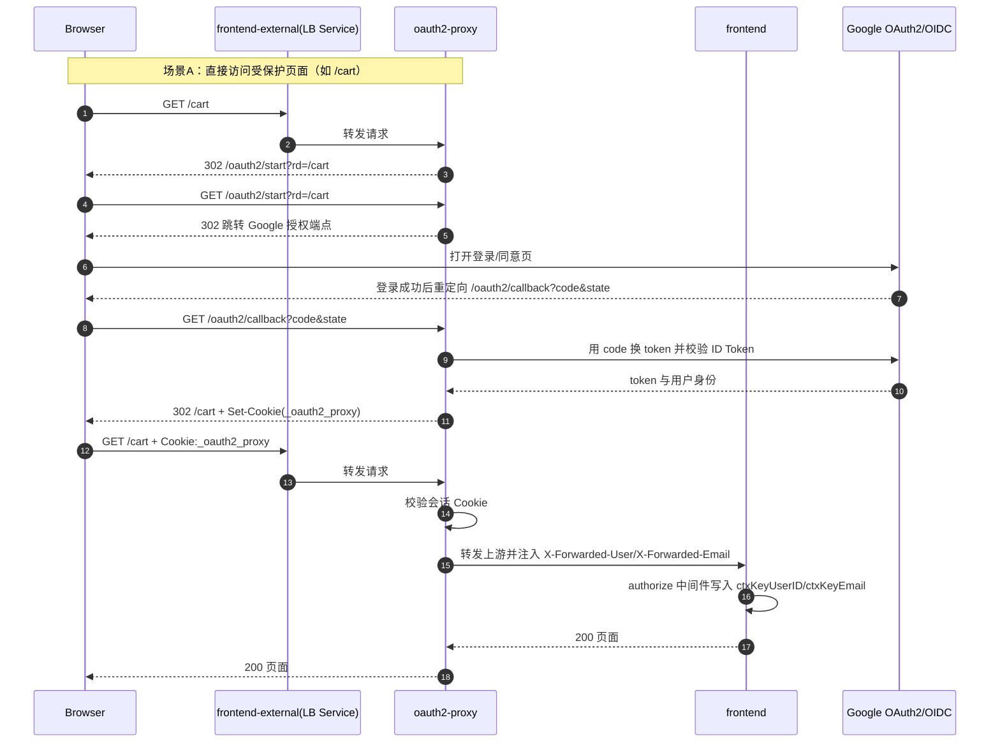
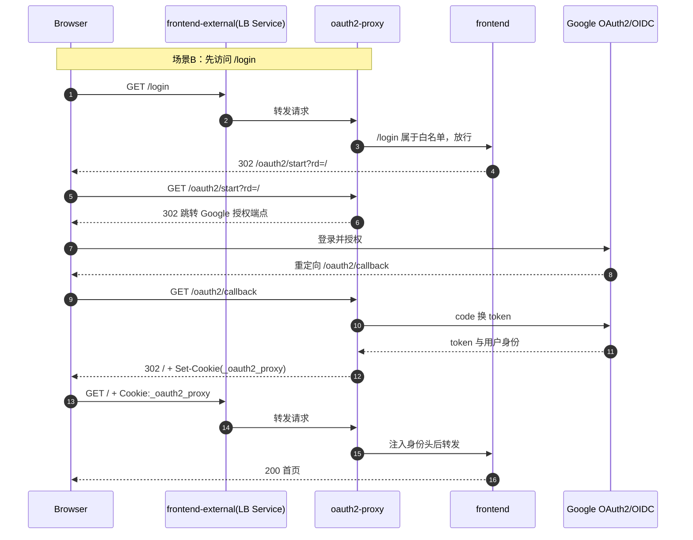

# Authentication and Login Technical Documentation

This document outlines the authentication architecture and login flow for the **Curated Store** project, focusing on the integration of **OAuth2 Proxy** and **Google OAuth 2.0**.

---

## Architecture Overview

The project implements a **Reverse Proxy Authentication** pattern. Instead of the application handling OAuth2 handshakes directly, a dedicated sidecar or gateway service (**OAuth2 Proxy**) sits in front of the `frontend` service.

* **OAuth2 Proxy**: Acts as the gatekeeper. It handles provider redirection, callback validation, and session cookie management.
* **Frontend Service**: Operates behind the proxy. It trusts the identity headers passed by the proxy and manages application-level session persistence.

---

## Authentication Flow

### The Login Procedure

When a user clicks "Login" or accesses a protected resource, the following happens:

1.  **`loginHandler`**: 
    * Checks for an existing `Authorization` header. If present, redirects to home.
    * If not authenticated, redirects the user to `/oauth2/start?rd={return_to}`, which is intercepted by the OAuth2 Proxy.
2.  **Provider Handshake**: OAuth2 Proxy redirects the user to Google. Upon successful login, Google redirects back to the proxy's `/oauth2/callback`.
3.  **Header Injection**: Once authenticated, the proxy forwards the request to the Go frontend, injecting the following headers:
    * `X-Forwarded-User`: The unique user identifier.
    * `X-Forwarded-Email`: The user's email address.
    * `Authorization`: The Bearer token (if configured).

### Whitelist Strategy (Public Routes)

To ensure high performance and accessibility for public content, specific paths bypass mandatory authentication.

* **Bypass Logic**: Defined in `IsAuthWhitelistPath`.
* **Whitelisted Paths**:
    * `/` (Home page)
    * `/_healthz` (Liveness probes)
    * `/login`
    * `/static/*` (CSS, Images, JS)
    * `/product/*` (Product details)
    * `/setCurrency`

These paths are configured both in the Go `authorize` middleware and the OAuth2 Proxy `OAUTH2_PROXY_SKIP_AUTH_ROUTES` environment variable to ensure consistency.

---

The image below shows what happens when a user accesses a **protected** resource:

---

If the path is **whitelisted**:

