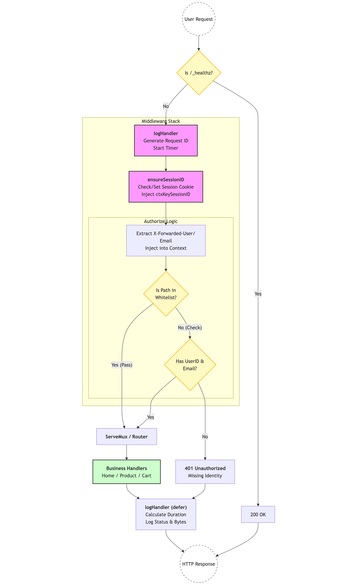

# Middleware Chain

Requests pass through a layered middleware stack before reaching the business logic handlers. This chain handles observability, security, and session management. See [middleware.go](../src/frontend/middleware.go) for more details.

## 1. OpenTelemetry (otelhttp)

The outermost layer uses `otelhttp.NewHandler` to **automatically** create an inbound span for every HTTP request, extracting propagation context from headers.

## 2. Authorization (authorize)

The authorize middleware extracts user identity from `X-Forwarded-User` and `X-Forwarded-Email` headers (provided by the [oauth2-proxy](https://github.com/oauth2-proxy/oauth2-proxy) sidecar). It enforces access control by checking if the request path is in the [IsAuthWhitelistPath](../src/frontend/validator/verifier.go#L62). Paths included in the *whitelist* are permitted directly and do not require identity authentication.

Beyond this, the project provides optional Token signature verification (see[verifier.go](../src/frontend/validator/verifier.go#L29)). This logic validates the Authorization request header at the middleware layer by retrieving Google's public keys. However, since Google's public key endpoint is *inaccessible* from China, the signature verification logic in `middleware.go` has been commented out.

## 3. Session Management (ensureSessionID)

This middleware ensures every user has a `shop_session-id` cookie. If missing, it either assigns a static ID (if `ENABLE_SINGLE_SHARED_SESSION` is true) or generates a new UUID. The session ID is injected into the request context using the `ctxKeySessionID` key.

Prior to the introduction of OAuth2 authentication, user identity was associated via Session IDs, making it critical to ensure every request had a valid sessionID. While the Session ID is replaced by *userID* provided by Google, it is still retained in the current implementation.

## 4. Logging (logHandler)

The `logHandler` generates a unique `requestID` and decorates a `logrus.FieldLogger` with request metadata (path, method, session). It uses a `responseRecorder` to capture the resulting HTTP status code and response size for post-request logging.

