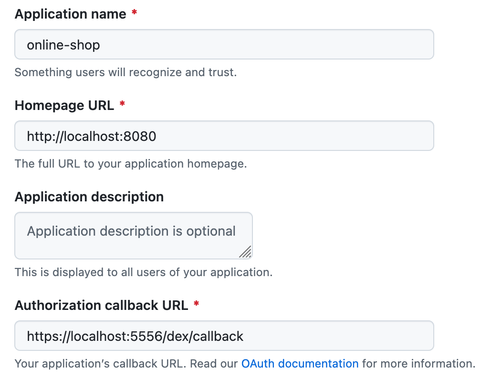

## Setup Guide

### Create GitHub OAuth App
Register a new OAuth application [here](https://github.com/settings/applications/new). 



Ensure the **Authorization callback URL** matches your Dex configuration (e.g., `https://localhost:5556/dex/callback`).

### Generate TLS Assets

Running Dex with HTTPS enabled requires a valid SSL certificate. Generate the necessary SSL certificates and CA files by running:
```bash
./src/frontend/gencert.sh
```
The assets will be generated in the `ssl/` directory.

### Run Frontend Service

Start the local frontend client using the generated CA:

```bash
go run . -issuer-root-ca ./ssl/ca.pem
```

### Configure Kubernetes Secrets

Create a namespace:

**Create Namespace:**

```bash
kubectl create namespace dex
```

**Create TLS Secret:**
```bash
kubectl -n dex create secret tls dex.example.com.tls \
  --cert=./cert.pem \
  --key=./key.pem
```

**Create GitHub Credentials Secret:**
```bash
kubectl -n dex create secret generic github-client \
  --from-literal=client-id=$GITHUB_CLIENT_ID \
  --from-literal=client-secret=$GITHUB_CLIENT_SECRET
```

### Deploy and Port-Forward

Dex will be deployed into the cluster after you run `skafoold run`. Port-forwarding can be done manually:

```bash
# Terminal 1: Frontend Service
kubectl -n default port-forward svc/frontend 8080:8080

# Terminal 2: Dex Issuer (Mapped to local 5556)
kubectl -n dex port-forward svc/dex 5556:8080
```

