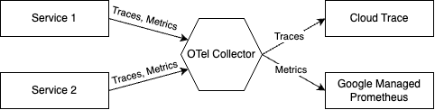
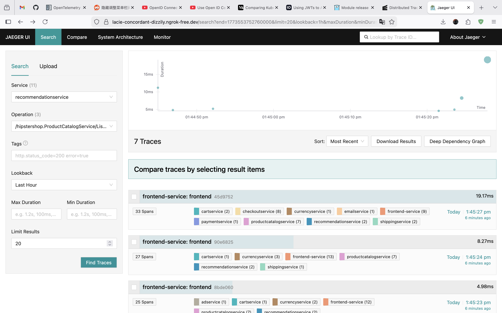
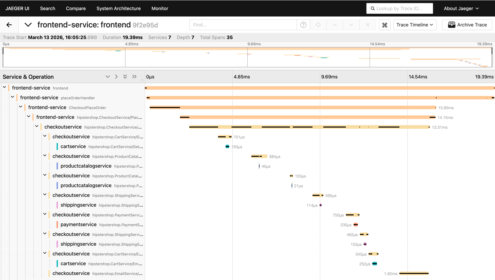

This project provides two ways to observe Traces:

* **Deploy Jaeger within the cluster**: The collector sends traces to Jaeger, and you can observe them using the Web UI provided by Jaeger. This is suitable for local deployment.
* **Send traces to Google Cloud**: The collector sends traces to Google Cloud, which is suitable for cloud-based deployment.

The only difference between the two methods lies in the **exporter** configuration within the otel-collector. For details, refer to `otel-collector-jaeger.yaml` and `otel-collector.yaml`. Regardless of the method used, a single **Collector** service exists in the cluster. Each service sends its collected telemetry data to this Collector, which then decides whether to export it to Jaeger or Google Cloud.

---

## OpenTelemetry Collector

This component adds a *single* collector service which collects traces and metrics from individual services and forwards them to the appropriate Google Cloud backend.

If you wish to experiment with different backends, you can modify the appropriate lines in [otel-collector.yaml](otel-collector.yaml) to export traces or metrics to a different backend.  See the [OpenTelemetry docs](https://opentelemetry.io/docs/collector/configuration/) for more details.

---

## Integration with Jaeger

Refer to the configuration file [otel-collector-jaeger.yaml](./otel-collector-jaeger.yaml). Jaeger is deployed as a pod within the cluster and exposes its Web UI on port **16686**, which is forwarded to `localhost:16686`. To access this page in a local browser, visit http://localhost:16686 in your browser, and you will see something similar to the following:

