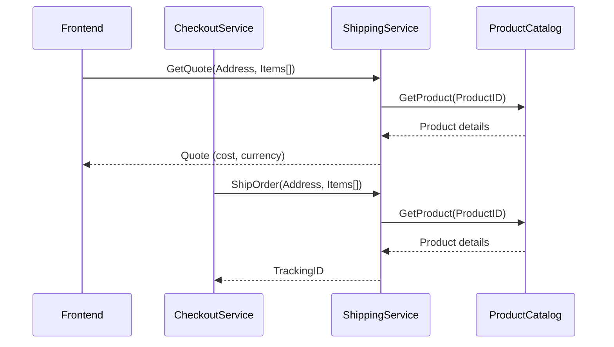

`ShippingService`接口共两个RPC API：

```proto
service ShippingService {
    rpc GetQuote(GetQuoteRequest) returns (GetQuoteResponse) {} // 获取运费报价，具体实现见 shippingservice/main.go 文件
    rpc ShipOrder(ShipOrderRequest) returns (ShipOrderResponse) {} // 发货，具体实现见 shippingservice/main.go 文件
}
```

时序图

